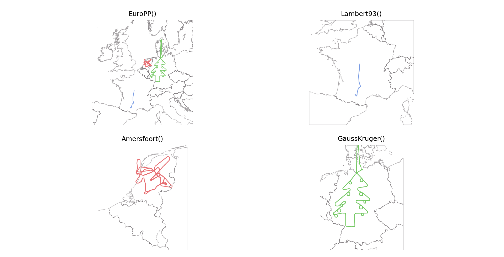
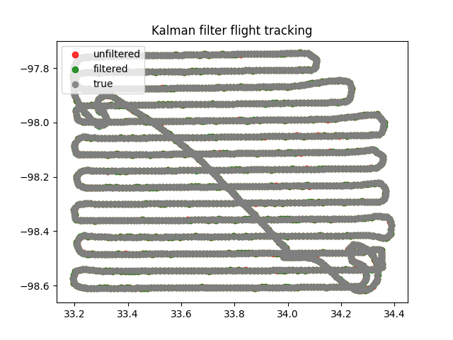
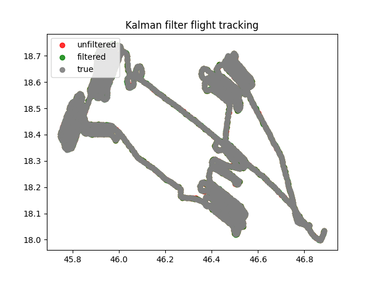
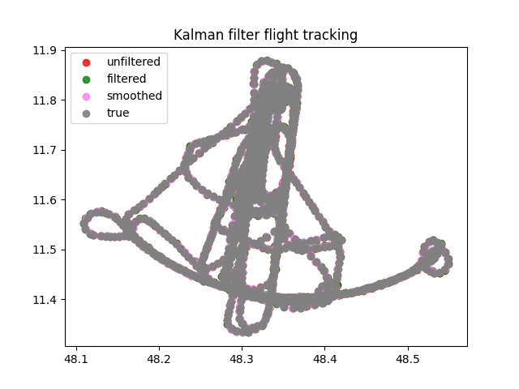
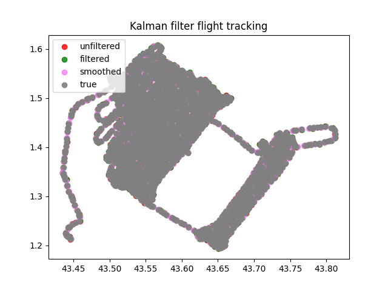

# gervigreind-project2

Project 2 for Artificial Intelligence course @ Reykjavík University

Ermir Pellumbi

Wojciech Woźniak

Yann Le Lorier

[TOC]


## Tasks

### Task 1 - Definition of the Model

#### The state vector $\boldsymbol{x_k}$ 

$\boldsymbol{x_k}$ can be defined as a vector that has as entries $\hat{x}$, $\hat{y}$ the coordinates for the airplane, and $\dot{x}$, $\dot{y}$, the velocity components:
$$
\boldsymbol{\hat{x}_k} = \begin{bmatrix}
\hat{x}\\
\hat{y}\\
\dot{x}\\
\dot{y}
\end{bmatrix}
$$


#### State Transition Matrix $F$

The state transition matrix $F$ can be defined as:

Reference: [State Extrapolation](https://www.kalmanfilter.net/stateextrap.html)
$$
F = 
\begin{pmatrix}
1 & 0 & \Delta t & 0\\
0 & 1 & 0 & \Delta t\\
0 & 0 & 1 & 0\\
0 & 0 & 0 & 1
\end{pmatrix}
$$
In this case, $\Delta t = 10s$ 

For the sake of being thorough, the control input input model $B_k$ is not necessary, since we are assuming  a constant velocity, and the control input $\boldsymbol{u_k} = \begin{bmatrix} 0\\0\\0 \end{bmatrix} $therefore:
$$
B_ku_k= 0
$$


#### Covariance Matrix $Q$ (check)

Reference: [Covariance (Kalman FIlter Tutorial)](https://www.kalmanfilter.net/covextrap.html)

The covariance matrix $Q$ can be drawn from the discrete noise model:


$$
\begin{align}
Q &= 
\begin{pmatrix}
V(x) & 0 & COV(x,\dot{x}) & 0\\
0 & V(y) & 0 & COV(y, \dot{y})\\
COV(\dot{x},x) & 0 & V(\dot{x}) & 0\\
0 & COV(\dot{y},y) & 0 & V(\dot{y})
\end{pmatrix}\\
&= \sigma_p^2
\begin{pmatrix}
\frac{\Delta t^4}{4} & 0 & \frac{\Delta t^3}{2} & 0\\
0 & \frac{\Delta t^4}{4} & 0 & \frac{\Delta t^3}{2}\\
\frac{\Delta t^3}{2} & 0 & \Delta t^2 & 0\\
0 & \frac{\Delta t^3}{2} & 0 & \Delta t^2
\end{pmatrix}
\end{align}
$$


Where $\Delta t = 10s$

#### Observation vector $\boldsymbol{z_k}$

The observation vector $z_k$ can be expressed as follows:
$$
\boldsymbol{z_k} =
\begin{bmatrix}
x\\
y
\end{bmatrix}
$$
#### Observation Matrix $H$

The dimensions of this matrix depend of the dimensions of $x_k$ and $z_k$, we have
$$
\boldsymbol{x_k}=
\begin{bmatrix}
x\\
y\\
\dot{x}\\
\dot{y}
\end{bmatrix}\\
\boldsymbol{z_k} = 
\begin{bmatrix}
z_1\\
z_2
\end{bmatrix}
$$
This way, we know that $H$ has to have a $n_z\times n_x$ dimension:
$$
Dim(H) = 2\times 4
$$
And the following matrix would be the result of $H$:
$$
H=
\begin{bmatrix}
1 & 0 & 0 & 0\\
0 & 1 & 0 & 0
\end{bmatrix}
$$
Let's verify, this way, $\boldsymbol{z_n} - Hx_{n,n}$ yields
$$
\begin{align}
	\boldsymbol{z_n} - Hx_{n,n} &=
	\begin{bmatrix}
		z_1\\
		z_2
	\end{bmatrix}
	-
	\begin{bmatrix}
		1 & 0 & 0 & 0\\
		0 & 1 & 0 & 0
	\end{bmatrix}
	\begin{bmatrix}
		\hat{x}\\
		\hat{y}\\
		\dot{x}\\
		\dot{y}
	\end{bmatrix}\\
	&=
	\begin{bmatrix}
	(z_1-\hat{x})\\
	(z_2-\hat{y})
	\end{bmatrix}
\end{align}
$$


Reference: [State Update (Kalman Filter tutorial)](https://www.kalmanfilter.net/stateUpdate.html)

#### Covariance matrix $R$

The covariance matrix $R$ can be defined as a $2\times 2$ diagonal matrix:
$$
\begin{align}
R &= \sigma_p^2
\begin{pmatrix}
V(x) & 0\\
0 & V(y)
\end{pmatrix}\\
&= \sigma_p^2
\begin{pmatrix}
\frac{\Delta t^4}{4} & 0\\
0 & \frac{\Delta t^4}{4}
\end{pmatrix}
\end{align}
$$


### Task 2 - Understanding the `traffic` data structure

According to the documentation of [Traffic core structure](https://traffic-viz.github.io/core_structure.html), the `traffic` library has three core classes:

- traffic.core.Flight built on top of Pandas Dataframe with attributes:
  - icao24
  - callsign
  - timestamp
  - latitude
  - altitude
- traffic.core.Traffic It's the class that represents a collection of multiple flights, flattened into a single pandas dataframe
- traffic.core.Airspace with properties:
  - area: area of the shape in square meters
  - bounds: returns the bounding box of the shape (west, south, east, north)
  - centroid: returns the centroid of the shape with a `shapely` point
  - extent: returns the extent of the bounding box of the shape (west, east, south, north)

**Plotting some examples from The Quickstart** 

The script for this can be found [here](./KalmanF/test_plots.py)

and can be run with the `IPython` Environment:

```sh
python -m IPython
```

Once inside the `IPython` environment, in the `KalmanF` directory:

```python
run test_plots.py
```




### Task 3 - Simulated Radar Measurements

### Task 4,5,6 - Implementation of Kalman Filter Model

see code [here](./KarlmanF/project2.py)

### Task 7 - Errors

We initialized a set of variables that allowed us to see just how much we were improving:

```python
tot_maxi_mean_noised = 0
tot_mean_mean_noised = 0

tot_maxi_mean_filtered = 0
tot_mean_mean_filtered = 0
```

These variables are the means of the noisy flight measurements and the means of the Kalman Filter calculations:

- For the maximum distance mean
- For the mean of the mean of each flight

According to the following tests with all 57 flights:

```
Results
tot_maxi_mean_noised
	>391.0309418603246
tot_mean_mean_noised
	>77.19454051003038
tot_maxi_mean_filtered
	>329.1883342295879
tot_mean_mean_filtered
	>81.10277553435715
```

this corresponds to a 15% improvement in performance for the Maximum distance mean

And a 4.8% decrease in performance for the Mean Distance mean.

The Mean of the means of the flights might not be an accurate measure for the tests, since the variance in distances can vary so much in every flight.

However, 15% improvement in performance is quite significant when looking at the maximum distances, and is a more relevant measure when talking about the Kalman Filter.

***

When running standalone tests we realized that:

We can see that the flights where the model performs worse are the flights where there almost no turns, and the Kalman filter lags behind the actual trajectory of the plane, in contrast to flights with lots of turns where the Kalman filter shines.

Another case where this model lacks is when the flight is so long that the curvature of the Earth starts to interfere with the $x$ and $y$ coordinates.

Examples:

**Texas**



```
FLIGHT texas:
----------------------------------------------------
Unfiltered:
	> Maxi Noised-true distance = 368.0398552764751 metres 
	> Noised-true distance mean = 78.07502070486713 metres
----------------------------------------------------
Filtered
	> Maxi Filtered-true distance = 344.5700516469794 metres
	> Filtered-true distance mean = 80.36512016919434 metres
----------------------------------------------------
Smoothed
	> Maxi smooth-true distance = 462.93678289309184 metres
	> smoothed-true distance mean = 73.98019868488753 metres
----------------------------------------------------
	> MSE for noised and filtered data = 0.4602397918622192
----------------------------------------------------
	> MSE for smoothed and filtered data = 0.07126882424120103
```

**Mecsek_Mountains**



```
FLIGHT mecsek_mountains:
----------------------------------------------------
Unfiltered:
	> Maxi Noised-true distance = 332.1547424985228 metres 
	> Noised-true distance mean = 79.19004120552896 metres
----------------------------------------------------
Filtered
	> Maxi Filtered-true distance = 316.1088571973523 metres
	> Filtered-true distance mean = 87.03547986707123 metres
----------------------------------------------------
Smoothed
	> Maxi smooth-true distance = 312.576325695486 metres
	> smoothed-true distance mean = 96.36541050437415 metres
----------------------------------------------------
	> MSE for noised and filtered data = 0.45394696496122267
----------------------------------------------------
	> MSE for smoothed and filtered data = -0.28074242081474604
```


### Task 8 - Process noises ($\sigma_p, \sigma_o$)

We conducted the following experiments on the same flight ('Indiana'):

The default configuration is $\sigma_p =1.5$ and $\sigma_o = 50$

Which gives the following results:

```
sigma_p = 1.5
sigma_o = 50
FLIGHT indiana:
----------------------------------------------------
Unfiltered:
	> Maxi Noised-true distance = 441.48696944927565 metres 
	> Noised-true distance mean = 77.87569935921748 metres
----------------------------------------------------
Filtered
	> Maxi Filtered-true distance = 371.3279219714824 metres
	> Filtered-true distance mean = 80.16127983061757 metres
----------------------------------------------------
Smoothed
	> Maxi smooth-true distance = 468.1162326627106 metres
	> smoothed-true distance mean = 74.09311894849391 metres
----------------------------------------------------
	> MSE for noised and filtered data = 0.4968693105338027
----------------------------------------------------
	> MSE for smoothed and filtered data = 0.03641297531147246
```

***

**Increasing $\boldsymbol{\sigma_p}$**

$\sigma_p = 2.0$ and $\sigma_o = 50$

```
sigma_p =  2.0
sigma_o =  50
FLIGHT indiana:
----------------------------------------------------
Unfiltered:
	> Maxi Noised-true distance = 353.4163422480058 metres 
	> Noised-true distance mean = 79.37480989105424 metres
----------------------------------------------------
Filtered
	> Maxi Filtered-true distance = 360.810467102113 metres
	> Filtered-true distance mean = 81.84231946051611 metres
----------------------------------------------------
Smoothed
	> Maxi smooth-true distance = 504.94389641433924 metres
	> smoothed-true distance mean = 74.10725035986285 metres
----------------------------------------------------
	> MSE for noised and filtered data = 0.49227161645261874
----------------------------------------------------
	> MSE for smoothed and filtered data = 0.06404908041253726
```

$\sigma_p=6.0$ and $\sigma_o = 50$

```
sigma_p =  6.0
sigma_o =  50
FLIGHT indiana:
----------------------------------------------------
Unfiltered:
	> Maxi Noised-true distance = 375.0564568936403 metres 
	> Noised-true distance mean = 80.00117433832473 metres
----------------------------------------------------
Filtered
	> Maxi Filtered-true distance = 341.667904568004 metres
	> Filtered-true distance mean = 81.42965737101616 metres
----------------------------------------------------
Smoothed
	> Maxi smooth-true distance = 562.8745911289549 metres
	> smoothed-true distance mean = 74.81923702049153 metres
----------------------------------------------------
	> MSE for noised and filtered data = 0.5147452982296843
----------------------------------------------------
	> MSE for smoothed and filtered data = 0.0738403670033474
```

**Increasing  $\boldsymbol{\sigma_o}$**

```
sigma_p =  1.5
sigma_o =  90
FLIGHT indiana:
----------------------------------------------------
Unfiltered:
	> Maxi Noised-true distance = 343.729617228672 metres 
	> Noised-true distance mean = 79.95736676284868 metres
----------------------------------------------------
Filtered
	> Maxi Filtered-true distance = 302.2262125578078 metres
	> Filtered-true distance mean = 81.77919504548613 metres
----------------------------------------------------
Smoothed
	> Maxi smooth-true distance = 478.09051194075016 metres
	> smoothed-true distance mean = 74.19241184714379 metres
----------------------------------------------------
	> MSE for noised and filtered data = 0.4827388002500181
----------------------------------------------------
	> MSE for smoothed and filtered data = 0.07559027769169555
```

**Decreasing $\boldsymbol{\sigma_p}$**

```
sigma_p = 1.2
sigma_o = 50
FLIGHT indiana:
----------------------------------------------------
Unfiltered:
	> Maxi Noised-true distance = 360.3628226803347 metres 
	> Noised-true distance mean = 79.66777623464304 metres
----------------------------------------------------
Filtered
	> Maxi Filtered-true distance = 379.82883366160013 metres
	> Filtered-true distance mean = 80.8087804735292 metres
----------------------------------------------------
Smoothed
	> Maxi smooth-true distance = 490.4660609533513 metres
	> smoothed-true distance mean = 72.58745441561136 metres
----------------------------------------------------
	> MSE for noised and filtered data = 0.5036479504188466
----------------------------------------------------
	> MSE for smoothed and filtered data = 0.07215325911246752
```

**Decreasing $\boldsymbol{\sigma_o}$**

```
sigma_p = 1.5
sigma_o = 25
FLIGHT indiana:
----------------------------------------------------
Unfiltered:
	> Maxi Noised-true distance = 345.3667597488944 metres 
	> Noised-true distance mean = 81.75506318274044 metres
----------------------------------------------------
Filtered
	> Maxi Filtered-true distance = 396.10849537806183 metres
	> Filtered-true distance mean = 82.69492120844849 metres
----------------------------------------------------
Smoothed
	> Maxi smooth-true distance = 437.47717498022956 metres
	> smoothed-true distance mean = 75.25928822247538 metres
----------------------------------------------------
	> MSE for noised and filtered data = 0.5081996297508472
----------------------------------------------------
	> MSE for smoothed and filtered data = 0.07614769434211349
```


After all of these observations, we have estimated that the best configuration for $\sigma_p$ and $\sigma_o$ is to have a higher $\sigma_p$, since the mean of the distances between the observations and true values is usually around ~80m. In order to compensate, the standard deviation from observations-true has to be around that value.

For $\sigma_o$, the value can stay around 1.5, since we are assuming that the error from factors like the wind don't affect too much the acceleration.
$$
\sigma_p = 80\\
\sigma_o = 1.5
$$


### Task 9 - Smoothing

After applying smoothing to a few flights we got the following results:

Texas:


```
FLIGHT texas:
----------------------------------------------------
Unfiltered:
	> Maxi Noised-true distance = 352.8493879155926 metres 
	> Noised-true distance mean = 79.61731578307588 metres
----------------------------------------------------
Filtered
	> Maxi Filtered-true distance = 320.93464816703624 metres
	> Filtered-true distance mean = 81.52581547518133 metres
----------------------------------------------------
Smoothed
	> Maxi smooth-true distance = 404.86205040283335 metres
	> smoothed-true distance mean = 75.48566996140885 metres
----------------------------------------------------
	> MSE for noised and filtered data = 0.4470104840654708
----------------------------------------------------
	> MSE for smoothed and filtered data = 0.0714315507931226
```


Munich




```
FLIGHT munich:
----------------------------------------------------
Unfiltered:
	> Maxi Noised-true distance = 313.572212617072 metres 
	> Noised-true distance mean = 79.09809845988879 metres
----------------------------------------------------
Filtered
	> Maxi Filtered-true distance = 304.27680641415327 metres
	> Filtered-true distance mean = 81.41582848905485 metres
----------------------------------------------------
Smoothed
	> Maxi smooth-true distance = 267.6121406178079 metres
	> smoothed-true distance mean = 79.84888554234618 metres
----------------------------------------------------
	> MSE for noised and filtered data = 0.5127898426516668
----------------------------------------------------
	> MSE for smoothed and filtered data = -0.08572482535956465
```

Pixair Toulouse



```
FLIGHT pixair_toulouse:
----------------------------------------------------
Unfiltered:
	> Maxi Noised-true distance = 332.3696159266508 metres 
	> Noised-true distance mean = 80.36958737099675 metres
----------------------------------------------------
Filtered
	> Maxi Filtered-true distance = 307.07507911577756 metres
	> Filtered-true distance mean = 85.87152637695127 metres
----------------------------------------------------
Smoothed
	> Maxi smooth-true distance = 369.2758745344607 metres
	> smoothed-true distance mean = 94.68033877727065 metres
----------------------------------------------------
	> MSE for noised and filtered data = 0.4196784555140438
----------------------------------------------------
	> MSE for smoothed and filtered data = -0.3957753653153553
```

We can definitely start to see a pattern. It seems that the smoothing method is preferred over the Kalman Filter when the flights have less sharp turns. If the flight trajectory makes rounder, longer turns, then the smoothing method sometimes outperforms the Kalman Filter (sometimes, because of the random noisy data)

However, when the flight is simple, like the case of Texas, where there are a lot of parts where the plane is flying straight, of there are sharp turns, the smoothing method seems to have lots of errors.

In conclusion, Smoothing is best when the flight pattern is simple, whereas the Kalman Filter is better suited for complex, sharp flight trajectories.

### Task 10 - Bonus (3D)

### Setting up the environment

`conda create --prefix kalman-env cartopy shapely python=3.7`

`conda activate ./kalman-env`

**Install traffic**

Has to be made via pip

`pip install traffic`

**Install geopy **

`pip install geopy`

**Install Kalman**

`pip install pykalman`

**Running the code**

We ran all of the tests and the code on the IPython environment (run the following command to avoid using the global python environment):

`python -m IPython`

and once inside the IPython environment:

`run project2.py [flight_name]` e.g. `indiana` or `munich`

